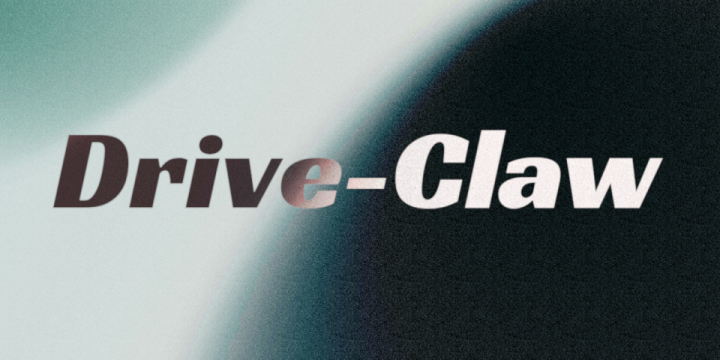
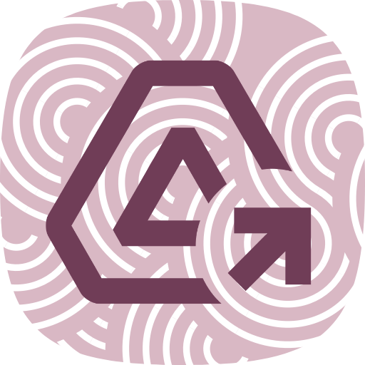

<a href="https://drive-claw-terminal.onrender.com/"></a>

|  | # Drive-Claw: Google Drive Discovery Terminal |
|:- |:-|

[**Drive-Claw**](https://drive-claw-terminal.onrender.com/) is a conversational AI agent engineered to bridge the gap between human intent and the structured chaos of your google drive. Built as a specialized "librarian" for Google Drive, it is an upgrade from simple keyword matching by translating natural language into high-precision API queries.

## The Tech Stack
The architecture is built on a decoupled, production-ready stack designed for performance, modularity, and elegance:
* **Backend:** Python with **FastAPI** for high-performance asynchronous API routing.
* **Agent Intelligence:** **LangGraph** (Cyclic State Machine) for advanced orchestration, state management, and recursive reasoning.
* **LLM Engine:** Powered by **gemma-4-26b** (via `langchain-google-genai`) for rapid intent recognition and tool calling.
* **Frontend:** **Streamlit** crafted with a beautiful easy on the eyes and bespoke UI/UX. (I love designing cool UIs)
* **Integration:** **Google Drive API (v3)** utilizing Service Accounts for secure, autonomous access.
* **Containerization:** **Docker** for seamless, environment-agnostic deployment.
* **Hosting:** Hosted on **Render** free-tier cloud environments.

## The Problem I Aimed Solved
Traditional file searching often requires exact keyword matches or tedious manual navigation through nested folders. **Drive-Claw** solves the "Discovery Friction" by:
* **Intent Translation:** Understanding *what* a user wants (e.g., "Find the financial report from last week") and translating it into a valid Google Drive `q` parameter.
* **Deep Discovery:** Bypassing the recursive limitations of the Drive API to peer into the deepest subfolders of a repository.
* **Contextual Awareness:** Maintaining a "Memory" of the conversation to allow for natural, back-and-forth clarification and exploration.

## Key Features

* **Natural Language Discovery:** Support for exact/partial name matches, MIME type filtering (PDFs, Docs, Sheets, Images), and full-text content searching.
* **Recursive Deep Search:** Custom logic that allows the agent to find nested files two or more directories deep.
* **Temporal Reasoning:** Real-time calculation of relative dates (e.g., "yesterday," "last month") into RFC 3339 timestamps.
* **Clinical UI/UX:** A sleek interface with custom CSS, visual "thinking" cues (spinners), and responsive chat bubbles.
* **Security First:** Strictly utilizes Service Account authentication and Environment Variable injection (no hardcoded credentials).
* **Tool Calling Logic:** Dedicated `DriveSearchTool` that prevents LLM hallucinations by enforcing strict query syntax.

## Build on your own

### Prerequisites
* Python 3.12+
* Google Cloud Project with Drive API enabled.
* Service Account JSON key and a Gemini API Key.

### Local Installation
1.  **Clone the Repo:** `git clone https://github.com/type-abhay/drive-speak/`
2.  **Environment Setup:** Create `.env` files in both `backend/` and `frontend/` folders with your API keys and folder IDs.
3.  **Docker Build:**
    ```bash
    # From root
    docker-compose up --build
    ```
    *Alternatively, run the backend and frontend separately using `uvicorn` and `streamlit`.*

## Deployment Note
This project is configured for deployment on **Render** using the provided Dockerfiles. Ensure that `GOOGLE_CREDENTIALS_JSON` and `BACKEND_URL` are correctly set in your cloud environment variables to facilitate the "Synaptic Handshake" between services.

---

### Thank You
Thank you for exploring **Drive-Claw**. This project was a journey into the physics of materials—translating messy, organic human language into the rigid, logical structures of machine query. It stands as a testament to the power of modern agentic frameworks and clinical UI design.

*Stay curious, stay sharp.*